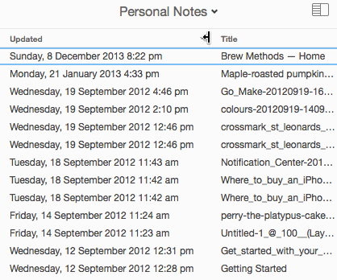

# Responsive content: time

Small experiment to adjust date/time display format according to viewport size.

Inspired by [Evernote](http://littlebigdetails.com/post/113069501344/evernote-automatically-converts-date-format):

